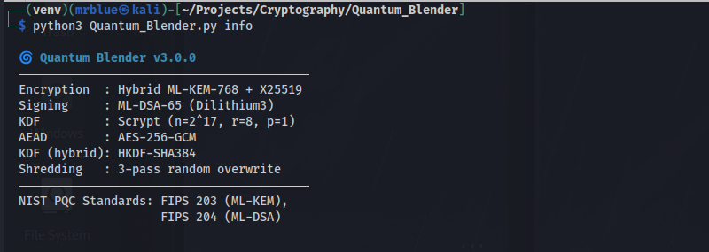
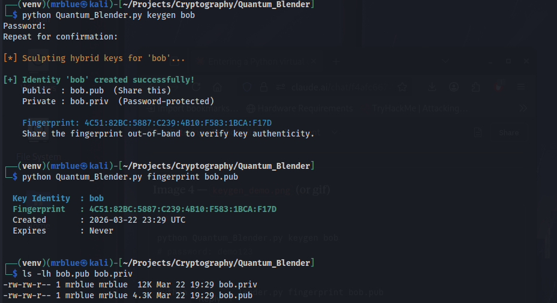
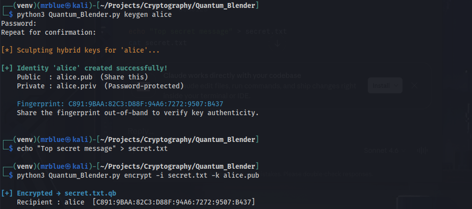
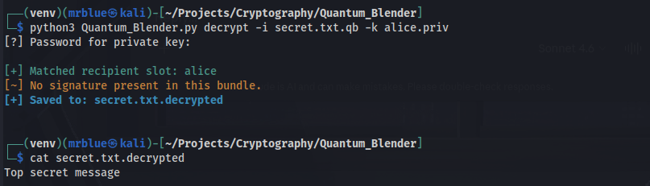
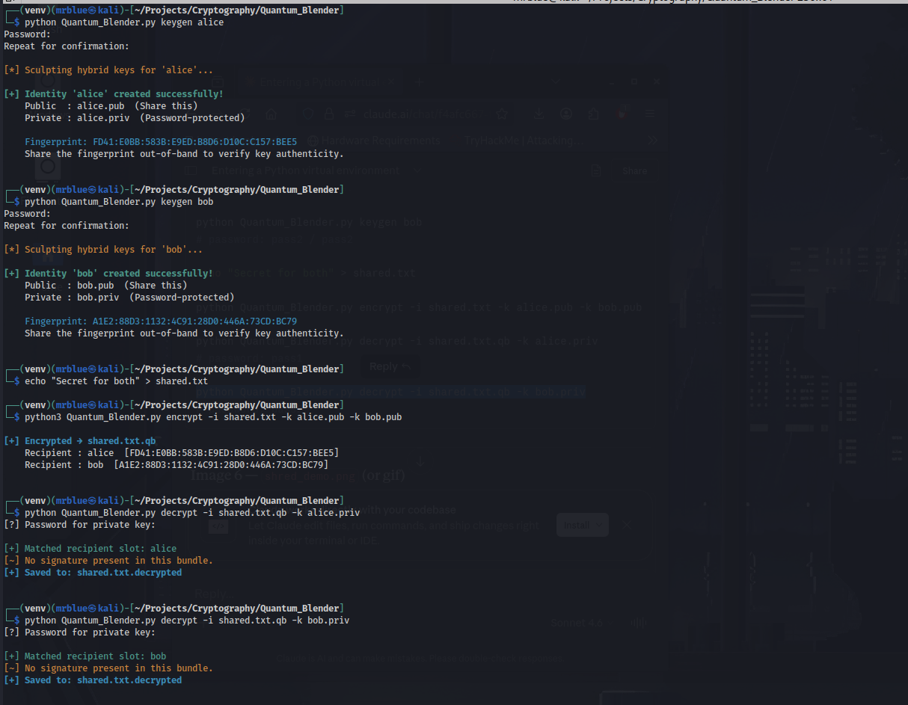
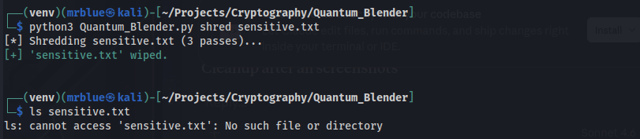
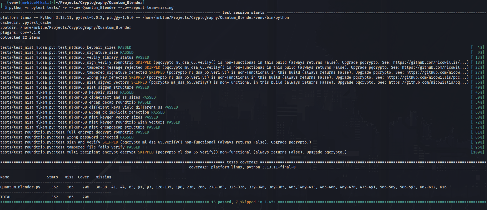

# 🌀 Quantum Blender

## Table of Contents

- [What Is This?](#what-is-this)
- [Algorithms](#algorithms)
- [Why Hybrid?](#why-hybrid)
- [Installation](#installation)
  - [Requirements](#requirements)
  - [Install](#install)
  - [Verify](#verify)
- [Quick Start](#quick-start)
  - [1. Generate your identity](#1-generate-your-identity)
  - [2. Encrypt a file](#2-encrypt-a-file)
  - [3. Decrypt a file](#3-decrypt-a-file)
  - [4. Multi-recipient encryption](#4-multi-recipient-encryption)
  - [5. Secure file shredding](#5-secure-file-shredding)
- [Commands](#commands)
  - [keygen](#keygen--generate-a-keypair)
  - [encrypt](#encrypt--encrypt-a-file)
  - [decrypt](#decrypt--decrypt-a-file)
  - [sign](#sign--sign-a-file)
  - [verify](#verify--verify-a-signature)
  - [fingerprint](#fingerprint--show-a-keys-fingerprint)
  - [shred](#shred--securely-wipe-files)
- [How It Works](#how-it-works)
  - [Encryption pipeline](#encryption-pipeline)
  - [Decryption pipeline](#decryption-pipeline)
  - [Key protection at rest](#key-protection-at-rest)
  - [.qb file format](#qb-file-format)
- [Testing](#testing)
- [Security Notes](#security-notes)
- [NIST Standards References](#nist-standards-references)
- [License](#license)

<div align="center">


**Hybrid Post-Quantum File Encryption CLI**
Resistant to both classical and quantum computer attacks.

[Installation](#installation) · [Quick Start](#quick-start) · [Commands](#commands) · [How It Works](#how-it-works) · [Testing](#testing) · [Security](#security-notes)

</div>

---

## What Is This?

Quantum Blender is a command-line encryption tool that combines **post-quantum** and **classical** cryptography into a single hybrid scheme. Even if a quantum computer breaks one layer, the other layer still protects your files.

It implements the two cryptographic standards NIST finalized in August 2024 as the world's first post-quantum standards:

- **FIPS 203** (ML-KEM, formerly CRYSTALS-Kyber) — quantum-safe key encapsulation
- **FIPS 204** (ML-DSA, formerly CRYSTALS-Dilithium) — quantum-safe digital signatures

---

## Algorithms

<div align="center">



</div>

| Role               | Algorithm          | Standard          | Key / Output Size        |
|--------------------|--------------------|-------------------|--------------------------|
| KEM (Post-Quantum) | ML-KEM-768         | NIST FIPS 203     | ek=1184B, dk=2400B       |
| KEM (Classical)    | X25519             | RFC 7748          | 32B shared secret        |
| Hybrid KDF         | HKDF-SHA384        | RFC 5869          | 32B master key           |
| Authenticated Enc  | AES-256-GCM        | NIST SP 800-38D   | 256-bit key, 96-bit IV   |
| Signatures         | ML-DSA-65          | NIST FIPS 204     | pk=1952B, sig=3309B      |
| Key Protection     | Scrypt+AES-256-GCM | RFC 7914          | n=2^17, r=8, p=1         |
| Secure Erase       | 3-pass random      | —                 | —                        |

---

## Why Hybrid?

A purely post-quantum scheme is new and less battle-tested. A purely classical scheme
(like RSA or ECC) will be broken by quantum computers running Shor's algorithm.
Quantum Blender uses both simultaneously — the shared secrets from ML-KEM-768 and
X25519 are combined with HKDF-SHA384, so an attacker must break **both** independently
to compromise your files.

```
[ ML-KEM-768 ]     [ X25519 ]
      |                 |
    kem_ss           ecc_ss
       \               /
        \             /
       [ HKDF-SHA384 ]
       salt = SHA256(kem_ss ‖ ecc_ss)
              |
         master_key
              |
       [ AES-256-GCM ]
              |
          Ciphertext
```

---

## Installation

### Requirements

- Python 3.11 or newer
- pip

### Install

```bash
git clone https://github.com/YOUR_USERNAME/quantum-blender.git
cd quantum-blender
python -m venv venv
source venv/bin/activate        # Windows: venv\Scripts\activate
pip install -r requirements.txt
```

### Verify

```bash
python Quantum_Blender.py --version
python Quantum_Blender.py info
```

---

## Quick Start

### 1. Generate your identity

```bash
python Quantum_Blender.py keygen alice
```

<div align="center">



</div>

Creates two files:
- `alice.pub` — Share this with anyone who wants to send you encrypted files
- `alice.priv` — Password-protected. Never share this.

The **fingerprint** shown (e.g. `C891:9BAA:82C3:...`) is a short hash of your public key.
Share it out-of-band (Signal, in person) so senders can verify your key is genuine.

---

### 2. Encrypt a file

```bash
# Single recipient
python Quantum_Blender.py encrypt -i secret.txt -k alice.pub

# Multiple recipients — each can decrypt independently
python Quantum_Blender.py encrypt -i secret.txt -k alice.pub -k bob.pub

# With your signature attached
python Quantum_Blender.py encrypt -i secret.txt -k alice.pub -s your.priv
```

<div align="center">



</div>

---

### 3. Decrypt a file

```bash
python Quantum_Blender.py decrypt -i secret.txt.qb -k alice.priv
```

<div align="center">



</div>

Quantum Blender automatically finds your recipient slot in the file and decrypts it.
The decrypted output is saved as `secret.txt.decrypted`.

---

### 4. Multi-recipient encryption

One encrypted file, multiple recipients — each decrypts independently with their own key:

<div align="center">



</div>

---

### 5. Secure file shredding

```bash
python Quantum_Blender.py shred sensitive.txt
```

<div align="center">



</div>

> ⚠️ **SSD Warning**: Overwrite-based wiping cannot guarantee complete erasure on SSDs
> due to wear-leveling, or on journaling filesystems (ext4, APFS, NTFS).
> Full disk encryption (e.g. LUKS on Linux) is the reliable solution.

---

## Commands

### `keygen` — Generate a keypair

```bash
python Quantum_Blender.py keygen NAME [--expires-days N]
```

| Option | Description |
|--------|-------------|
| `NAME` | Identity name — creates `NAME.pub` and `NAME.priv` |
| `--expires-days N` | Optional expiry in N days. Expired keys are rejected at encrypt time. |

---

### `encrypt` — Encrypt a file

```bash
python Quantum_Blender.py encrypt -i FILE -k RECIPIENT.pub \
    [-k RECIPIENT2.pub] [-s SIGNER.priv] [-o OUTPUT] [--shred]
```

| Option | Description |
|--------|-------------|
| `-i FILE` | File to encrypt |
| `-k PUBKEY` | Recipient's `.pub` file. Repeat for multiple recipients. |
| `-s PRIVKEY` | Your `.priv` to sign the ciphertext (optional) |
| `-o OUTPUT` | Output filename (default: `FILE.qb`) |
| `--shred` | Securely wipe original after encryption |

---

### `decrypt` — Decrypt a file

```bash
python Quantum_Blender.py decrypt -i FILE.qb -k YOUR.priv \
    [-vk SENDER.pub] [-o OUTPUT]
```

| Option | Description |
|--------|-------------|
| `-i FILE.qb` | Encrypted `.qb` file |
| `-k PRIVKEY` | Your `.priv` file |
| `-vk PUBKEY` | Sender's `.pub` to verify their signature (recommended) |
| `-o OUTPUT` | Output filename (default: `FILE.decrypted`) |

---

### `sign` — Sign a file

```bash
python Quantum_Blender.py sign -i FILE -k YOUR.priv [-o OUTPUT.sig]
```

Creates a detached `.sig` file using ML-DSA-65. The original file is unchanged.

---

### `verify` — Verify a signature

```bash
python Quantum_Blender.py verify -i FILE -s FILE.sig -k SIGNER.pub
```

---

### `fingerprint` — Show a key's fingerprint

```bash
python Quantum_Blender.py fingerprint alice.pub
```

---

### `shred` — Securely wipe files

```bash
python Quantum_Blender.py shred FILE [FILE2 ...] [--passes N]
```

Default is 3 overwrite passes. Increase with `--passes 7` for higher assurance.

---

## How It Works

### Encryption pipeline

1. **KEM**: `ml_kem_768.encrypt(ek)` → ciphertext `ct` + `kem_ss`
2. **ECDH**: ephemeral X25519 key → `ecc_ss = ephemeral_sk.exchange(recipient_pk)`
3. **Hybrid KDF**: `master_key = HKDF-SHA384(salt=SHA256(kem_ss‖ecc_ss), ikm=kem_ss‖ecc_ss)`
4. **AEAD**: `ciphertext = AES-256-GCM(master_key, nonce, plaintext, aad=CONTEXT)`
5. **Sign** (optional): `signature = ml_dsa_65.sign(dsa_sk, plaintext)`

### Decryption pipeline

1. Find recipient slot matching your private key
2. `kem_ss = ml_kem_768.decrypt(dk, ct)`
3. `ecc_ss = your_ecc_sk.exchange(ephemeral_ecc_pk)`
4. Reconstruct `master_key` via HKDF
5. `plaintext = AES-256-GCM-decrypt(master_key, nonce, ciphertext)`
6. Verify ML-DSA-65 signature if `--verify-key` provided

### Key protection at rest

```
derived_key = Scrypt(password, salt, n=2^17, r=8, p=1)
ciphertext  = AES-256-GCM(derived_key, nonce, key_bundle, aad=CONTEXT)
```

### .qb file format

Encrypted files are JSON with per-recipient key slots:

```json
{
  "version": "3.0.0",
  "encrypted_at": 1700000000,
  "recipients": [
    {
      "name": "alice",
      "fingerprint": "C891:9BAA:82C3:D88F:94A6:7272:9507:B437",
      "kem_ct":  "<base64>",
      "ecc_ct":  "<base64>",
      "nonce":   "<base64>",
      "payload": "<base64>"
    }
  ],
  "signature": "<base64 or null>",
  "signer_name": "bob",
  "signer_fingerprint": "4C51:82BC:..."
}
```

---

## Testing

```bash
pip install pytest pytest-cov
python -m pytest tests/ -v --cov=Quantum_Blender --cov-report=term-missing
```

<div align="center">



</div>

### Test coverage

| Test File | What It Tests |
|-----------|--------------|
| `test_nist_mlkem.py` | FIPS 203 key sizes, encap/decap round-trips, NIST ACVP KAT vectors |
| `test_nist_mldsa.py` | FIPS 204 key/sig sizes, tamper detection, NIST ACVP sigVer vectors |
| `test_roundtrip.py` | Full CLI: keygen → encrypt → decrypt → sign → verify → tamper detection |

NIST Known Answer Test vectors sourced from the official
[NIST ACVP Server repository](https://github.com/usnistgov/ACVP-Server/tree/master/gen-val/json-files).

### Known skip reasons

7 tests are currently skipped due to a confirmed bug in `pqcrypto 0.4.0` where
`ml_dsa_65.verify()` always returns `False` regardless of whether the signature
is valid. Quantum Blender's `_mldsa_verify()` detects this at runtime and raises
`ValueError` rather than silently accepting unverified signatures.
These tests will automatically un-skip when a fixed version of `pqcrypto` is released.

---

## Security Notes

### What Quantum Blender protects against

| Threat | Protection |
|--------|-----------|
| Quantum attacks on key exchange | ML-KEM-768 (FIPS 203) |
| Quantum attacks on signatures | ML-DSA-65 (FIPS 204) |
| Classical cryptanalysis | AES-256-GCM, HKDF-SHA384, X25519 |
| Ciphertext tampering | AES-GCM authentication tag |
| Key file theft | Scrypt-hardened password protection (n=2^17) |
| Signature forgery | ML-DSA-65 detached signatures |

### What it does NOT protect against

- Compromise of your private key with a weak password
- Memory forensics on a running system
- Side-channel attacks (software implementation only)
- Reliable secure deletion on SSDs
- Metadata leakage (file size, recipient names visible in `.qb` JSON)

### Reporting vulnerabilities

Do **not** open a public GitHub issue for security bugs.
Open a private advisory:
`https://github.com/YOUR_USERNAME/quantum-blender/security/advisories/new`

---

## NIST Standards References

| Standard | Title | Link |
|----------|-------|------|
| FIPS 203 | Module-Lattice-Based Key-Encapsulation Mechanism Standard | [csrc.nist.gov](https://csrc.nist.gov/pubs/fips/203/final) |
| FIPS 204 | Module-Lattice-Based Digital Signature Standard | [csrc.nist.gov](https://csrc.nist.gov/pubs/fips/204/final) |
| NIST ACVP ML-KEM | ACVP spec for ML-KEM | [pages.nist.gov](https://pages.nist.gov/ACVP/draft-celi-acvp-ml-kem.html) |
| NIST ACVP ML-DSA | ACVP spec for ML-DSA | [pages.nist.gov](https://pages.nist.gov/ACVP/draft-celi-acvp-ml-dsa.html) |
| NIST ACVP Vectors | Official KAT vectors used in this project | [github.com/usnistgov](https://github.com/usnistgov/ACVP-Server/tree/master/gen-val/json-files) |

---

## License

MIT — see [LICENSE](LICENSE)

---

<div align="center">
Built with post-quantum cryptography standardized by NIST in August 2024.
</div>
